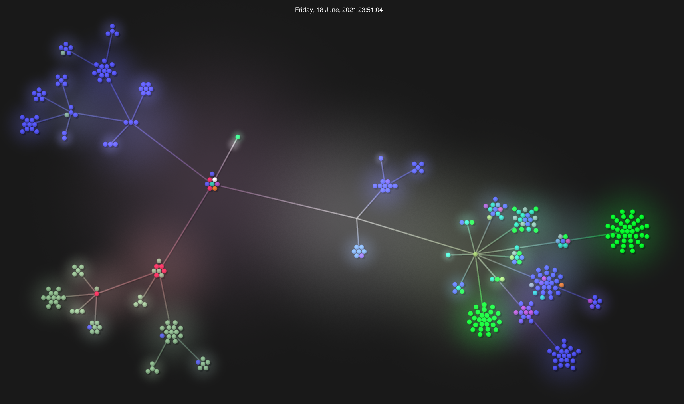

<h1 align="center">💣 About the code 💣</h1>
<p>
  
</p>

## 💣 The Main class (Bomberman.cpp) 💣

It's role is to create a new window, and hold the Entity-Component System's **Manager**.
Its constructor tells the Manager to load the Main Menu scene and then runs the Manager's scene loop for the first time.

## 💣 The Entity Component System (ECS folder) 💣

This programming pattern is well-known by game developers for its flexibility and ease of use.

It works by having a Manager that holds Entities.
These entities do not implement functionality :
They instead can host Components that implement code.

example : A cube of size 2 units, at the origin of the world

```c++
void Manager::AddCube() {
  auto& entity = addEntity("my cube entity");
  entity.addComponent<TransformComp>(Vector3D::Zero());
  entity.addComponent<BasicCubeComp>(Vector3D::One().Multiply(2))
}
```

Entities also have a pointer to their manager, so they can create other entities.

The **Manager** calls its **entities**' update() and draw() methods in the scene loop.

When added to an Entity, Components see their init() method called once they are constructed and placed into the entity's **components** vector.
This is useful to get references to other entities' components.

## 💣 Models Animations 💣

We went through a lot of struggle trying to animate 3D models properly.
* The bomb explosion model has an embedded animation (GLTF format) that is loaded and working.
* The player running animation is done by loading the animation frames as separate models and drawing each of them one after the other (spritesheet style).
* The powerup floating animation is done by offsetting the Y draw position by a value that is linearly eased over time (interpolated) indefinitely.
* There is also a 2D animated sprite billboard component (AnimatedSprite class) that was used as placeholders in early development stages.

## 💣 Procedural level generation (MapComponent class) 💣

The floor and walls are generated depending on a 2D size vector (**Vector2D**).
The **num_obstacles** obstacles are placed randomly inside the remaining empty spaces of the map, leaving an "L" shaped obstacle-free zone for the player to begin bombing its way through, similarly to the original game.

## 💣 Level Loading and Saving (GameSaveLoad class, SaveData.h) 💣

The Load/Save system is implemented using boost::filesystem and boost::serialization and a SaveData struct containing the following :

```c++
    std::vector<Vector3D> obstacles;
    std::array<PlayerData, 4> players;
    std::vector<BombData> bombs;
    std::vector<PowerUpData> powerUps;
```

Upon saving, it generates a SaveData struct and fills it with the current game data, then writes it as a boost text_archive to "./savedGame".

Then, on loading, it reads the boost archive back into a SaveData struct, to be loaded by the GameLogicComp at game start.

## 💣 Raylib Custom Encapsulation (raylib_encap folder) 💣

These classes encapsulate raylib functionality in a handy way for our needs.
Most of these are used by a Component (example : EModel, ModelComp), so that the called functions could be refactored to call another lib's methods.
