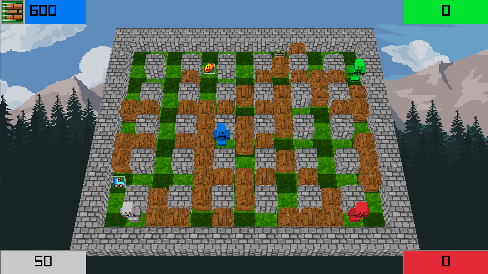

<h1 align="center">💣 Welcome to Indie Studio (Bomberman clone) 💣</h1>

<p>
  
</p>

> A clone of Bomberman made in C++, using Raylib, Boost, featuring custom Raylib encapsulation, a flexible Entity-Component System, AI, controller support, procedural level generation, loading and saving games, and more !

## 💣 Build Instructions 💣

At the root of this repository :
Make sure you have the latest submodules
```sh
git submodule init
git submodule update --remote
```
Then :
```sh
mkdir build && cd build && cmake --build . && cd ..
```

## 💣 Usage 💣

Windows:
```sh
.\bomberman.exe [-f : start fullscreen (default=windowed)]
```
Linux:
```sh
./bomberman [-f : start fullscreen (default=windowed)]
```

There is a "how to play" button available on the main menu.

## 🎮 Controller support notes 🎮

* If player N choses "Controller" as input module, the game will look for the Nth controller.  
* Left joystick and D-pad have the same behavior (move player).
* Right trigger to drop bombs.

## 💾 Saving and Loading games 💾

* While in the pause menu, you can click the "Save Game" button. This will create or overwrite the existing saveGame file.
* While in the main menu, you can click the "Load Game" button. This will make you able to select input methods and then start the game from the point you saved it.

## 💣 [About the code (technical documentation)](./about.md) 💣

## 💣 Authors 💣

👤 **Leo Fabre (leader), Adrien Courbebaisse, Achille Bourgault, Fréderic Lawecki-Walkowiak, Thomas Meurice, Daniyel Gouasmi**

* Github: [@LeoFabre](https://github.com/LeoFabre)
* LinkedIn: [@leo-fabre](https://linkedin.com/in/leo-fabre)

## 💣 Show your support 💣

Give a ⭐️ if this project helped you!
Big shoutout to Carl for the ECS tutorials ! [@youtube](https://www.youtube.com/watch?v=QQzAHcojEKg&list=PLhfAbcv9cehhkG7ZQK0nfIGJC_C-wSLrx)

***
_This README was generated with ❤️ by [readme-md-generator](https://github.com/kefranabg/readme-md-generator)_
